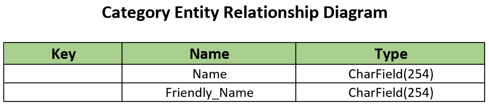
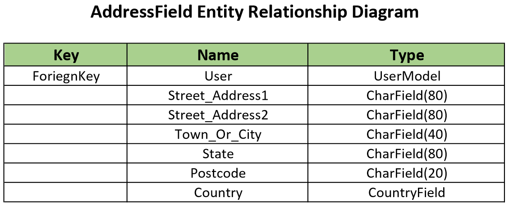
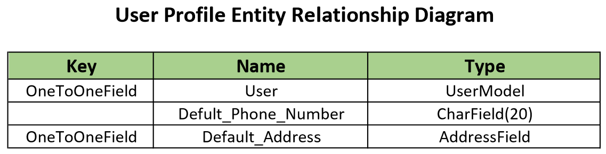
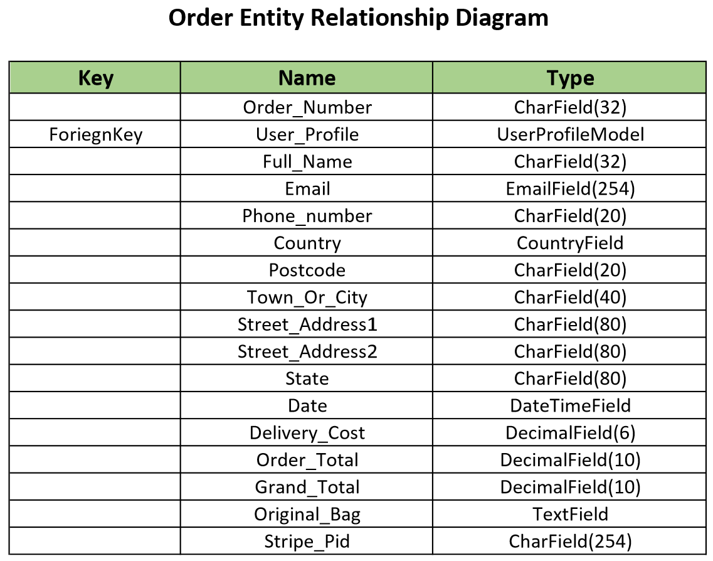
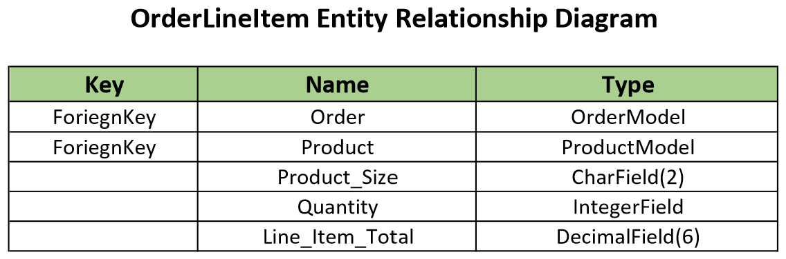

# SmartRack
This site is a type of ECommerce website, with working payment system from Stripe, deployed on Heroku, integrating static & media files in Amazon Web Services.

---
## User Experience (UX)

### User Stories

- As a Site User I can register for a account so that I can have my own account and view my personal profile

- As a Site User I can Login or Logout so that I can view my Account Information, view my Orders..

- As a Site User I can receive feedback for account registration so that I can proceed with login, purchases, viewing my account, orders

- As a Site User I can be able to reset my password if I forgot the password so that I can recover my account

- As a Site User I can have a personalised user profile so that I can view / edit my account information, orders, payment information.

- As a Shopper I can View List of Products so that I can select Products to purchase

- As a Shopper I can Search for Products by name or description so that I can find a specific Product of my requirement

- As a Shopper I can easily view the total amount of my purchases so that I canavoid spending too much

- As a Shopper I can get access to available Deals, Clearance Sale Products or any Special Offers so that I can take advantage of the offers on Products

- As a Shopper I can View Individual Product details so that I can find more details about the product, price, ratings, product images, models or sizes.

- As a Shopper I can be able to Sort the list of available Products so that I can choose the best rated, best priced, view the sorted Products

- As a Shopper I can Sort Products by selecting multiple categories so that I can find best priced, rated products from all categories selected

- As a Shopper I can View or Modify Items in my Cart to be purchased so that I can Identitfy total cost of Items, able to Modify Items before checkout

- As a Shopper I can Easily select Size & Quantity of Products so that I can ensure selecting the right size, quantity of required product

- As a Admin/StoreOwner I can Add new Products so that I can Update my Store/Website with new Items for Shoppers

- As a Admin/StoreOwner I can Edit/Update Products so that I can Modify product prices, descriptions, images, update deals and other data

- As a Admin/StoreOwner I can Delete a Product so that I can remove items which are no longer for sale

- As a Shopper I can Enter Payment Information easily so that I can check out with out any hassels

- As a Shopper I want to feel my Personal information to be safe & secure so that I can confidiently provide necessary information for purchasing

- As a Shopper I can View my Order confirmation after checkout so that I can verify that I haven't made mistakes

- As a Shopper I want to receive email confirmation after checkout so that I can keep the confirmation of my purchases for records

---
### Wireframes

- Home Page

---
### Relationship Diagrams

- Product Entity Relationship Diagram

- Category Entity Relationship Diagram

- AddressField Entity Relationship Diagram

- UserProfile Entity Relationship Diagram

- Order Entity Relationship Diagram

- OrderLineItem Entity Relationship Diagram

---
## Features

- The Entire Site is powered by Django & styled using Bootstrap to ensure the site is responsive over different devices & different screen sizes, and at the same time providing a smooth experience for the user.

- All static files & media content are hosted through Amazon Web Services (AWS) static web hosting.

- Apart from accepting account registration by email, Sign up using Google account is also provided.

- Stripe is used for Payments.

- MailerLite is used for managing subscriptions.

- Postgresql used for database storage

- Deployment of the entire site is done on Heroku.

### Existing Features
- __Navigation Bar__

    The fully responsive navigation bar including links to Home, Register, Login & Logout, View Bag, Search Bar, Profile, ProductManagement, All Products, Special Offers

    - __Home__

        The main Home page contains the navigation bar as mentioned above, a short description of the website itself, with a shop now button, a background image, a footer with links to social media pages and newsletter subscription form.

    - __Register__

        The Sign up page allows users to register themself so that they can proceed with shopping and managing their own profile and accessing all provided data over the website.

        As per the latest requirements of django allauth, users need to enter email address two times, a valid username & a valid password to register.

        A verification email will be sent to the email address provided, which upon verification the user is able to login.

    - __Login / Logout__

        The SignIn page allows registered and validated users to sign in, for a logged in user - Logout button is visible to allow them to signout.

    - __Forgot Password?__

        The SignIn page also allows users to reset their password, provided the user is already registered. Accessing the forgot password button with a vaild email, a verification mail shall be sent to the user thourgh with the user can reset the password.

    - __Bag__

        A logged in user at any time can access their shopping cart / bag  by accessing the bag icon from navigation bar on the top.

- __Main Content__

  - __Products__

    Clicking the Shop Now button on Home Page shows all the available products as a scrollable grid view on the website.
    
    Each Product is a simple card view with a product image, name, price of product, category of the product and rating provided by other users.

    Free Delivery purchases over a specific amount is displayed on the top.

    Total products available are shown on the top right of the list.

    Sorting the products option is shown on the top left of the list.

    Multiple Sorting can be done as :

    - By Price Low to High
    - By Price High to Low
    - By Rating Low to High
    - By Rating High to Low
    - By Name A-Z
    - By Name Z-A
    - By Category A-Z
    - By Category Z-A

    Direct view of products by single sort option can be accessed from the dropdown button All Products from the navigation bar which sorts products by :
    - By Price
    - By Rating
    - By Category
    - All Products

    Special Offers on products can be accessed from the dropdown button Special Offers from the navigation bar with shows :
    - New Arrivals
    - Deals
    - Clearance
    - All Specials

    A user logged in as site admin has access to edit or delete a product directly from the products page, without browsing to the Django Admin Page

  - __Product Detail__

    A individual product detail can be accessed from clicking any product from the products view.

    Each detail view shows the image, name, price and rating,
    A description is provided for the product selected,
    if the product has size options, a size option dropdown is provided for selection of product size,
    A quantity selector is provided to select the quantity of product to be purchased,
    An Add to Bag button is provided to add the selected product to the shopping cart / bag.
    A toast message shows the selected product added to your shopping cart/bag with a description of total amount and a link to checkout.
    To keep shopping for further more products, keep shopping button can be accessed.
    To proceed to viewing bag or checkout user can access the toast notification message or through the bag button on the navigation bar.

  - __Bag__

    View Bag / Shopping Cart directly from the naviagation bar, provides the current shopping bag details
    Shopping Bag shows details of the product in horizontal layout
    Image, Product Name, Size, Sku of the product, Price of the product and quantity selector and finally the subtotal for that product with quantity
    Adjusting the quantity through quantity selector increment or decrement will update the bag only after confirming with Update button below the quantity selector.
    An Product can be removed from the Shopping Bag by pressing Remove button below the quantity selector.
    Toast messages will be displayed upon accessing the update or remove buttons.

    Grand Total of the shopping bag is updated accordingly
    Delivery Costs also will be shown if Free Delivery Threshold is not reached.
    Also a note displays for remaining shopping amount for qualifying to the Free Delivery.

    To keep further shopping, Keep Shopping button can be accessed.
    To checkout, Secure Checkout button can be accessed.

  - __CheckOut__
    
    A User can browse with out logging in to the website, but is always suggested to register to the website, so that all the order history, order details can be saved and viewed later.

    User information as fullname, email address and delivery information can be updated from this page.
    If the default delivery address needs to be updated the check box - Save this delivery information to my profile can be checked before completing order.
    Providing the payment card details and accessing the Complete Order processes the payment and updates the delivery information, order details from Stripe, which also will be added to the Orders in DataBase.
    A toast notification message will be displayed further after successful payment with order number.

    A checkout success page displays a Thank You message with the summary of Order & Delivery Information.

    A button - Now Checkout the Latest Deals! is provided for further access to the uses to check latest deals if any.

    A confirmation email will be sent to provided email address.

  - __My Profile__

    Each registered user is provided by default their own Profile page.
    For the firt time visitor to the My Profile page, only username and email address is shown, as this the basic information provided while registering to the website.
    The checkout page requires a fullname of the user for shipping details, these data can be updated here in my profile page
    The default delivery information, the delivery address for the user can be updated here.

    For the regular visitor to the My Profile page, the saved information will be displayed, which can be modified if required and to save the updated information, access the Update Information button.

    A toast message will be displayed upon saving the updated Profile.

    On the right side to the profile information Order History is displayed as a table:
        - Order Number
        - Date of Purchase
        - Ordered items - from order inlineitems
        - Order Total

  - __Product Management__

    A user registered as super user or the Store Owner/Admin has access to Link Product Management from the dropdown MyAccount.

    Using this page Store Owner/Admin can be able to Add new Products to the Data Base and update their WebSite directly.

    Necessary information like - Name, Description & Price of the Product is must to create a Product.

    Select the Category in which a new Product is to be created.
    Assign a Sku for the Product.
    Set the has sizes for the Product.
    Provide the initial Rating.
    Select the Product Image, which will be shown on the page for preview.
    To create the new Product and add to the list of existing products - Click Add Product, which will redirect to the products page.

- __Footer__

    The footer is having links to social media pages and a subscribe to newsletter form, where a user by providing their email address can subscribe to newsletter for latest updates on products, deals.

### Features Left To Implement

- A user logged in as superuser, Site Admin has the ability to delete a product - which as of now deletes immediately on pressing the delete button, later can be extended using the toast messages to ask for confirmation again.
- Each product can be having its own customized size/shape, which can be implemented as a seperate model and linked to the product model.
- A user can set products as favourites or add to a list which can be later browsed for easy access.
- A user can be provided with adding multiple delivery addresses with a single login, where a default or delivery address can be selected at the time of checkout or from user profile.
- Each Product can have its own reviews provided by other customers, which can be shown in the product detail page.

---

## Testing

- Unit tests are written for the python code in the project.

- Tests are written for forms & views.

        SmartRack/
        ├── bag/
        │   ├── tests_forms.py
        │   ├── tests_views.py
        ├── checkout/
        │   ├── tests_forms.py
        │   ├── tests_views.py
        ├── home/
        │   ├── tests_views.py
        ├── products/
        │   ├── tests_forms.py
        │   ├── tests_views.py
        ├── profiles/
        │   ├── tests_forms.py
        │   ├── tests_views.py

- Forms test perform form validity checks and form fields validity checks.

- Views test perform render validity checks and some of submit validity checks.

- All tests return passed, command used in VS-Code Terminal - 'python manage.py test'

- The site is being manually tested over different virtual screen sizes and orientations - Potrait & Landscape.

- Manual testing was carried out on an 17 inch Laptop, Microsoft Surface Pro 7, Apple Iphone 16 Pro Max, Apple Iphone 12, Apple Ipad Air4 & Apple Ipad Pro 12.9

### Validator Testing

- HTML Validator checking passed with no errors

- CSS Validator checking passed with no errors

- Lighthouse Score tested on Chrome Browser.

    
### Testing User Stories from User Experience (UX) Section

- As a site user 

---
## Known Bugs

---
## Deployment

- This site is deployed from Heroku hosting platform

- Steps for Deployment
    - Fork or Clone this Repository
    - Create a new Heroku App
    - Set the buildpacks to python
    - Reveal Config Vars to add secret keys and its respective values
    - Link the Heroku App to the Repository
    - Click on Deploy (optionally Automatic Deployment)
   

The live link can be found here - https://smart-rack-project-6598ef5f8933.herokuapp.com/

---
## Credits
- This project is developed based on the reference project taught by [Code Institute](https://codeinstitute.net/global/) on Full Stack Development Course

---
## Content
- All content was written by the developer.

