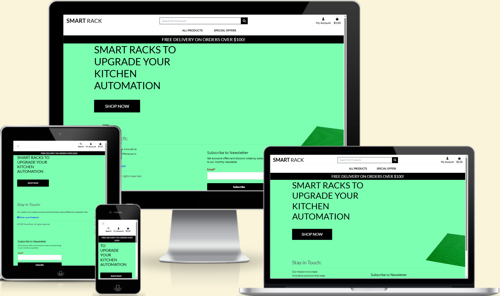
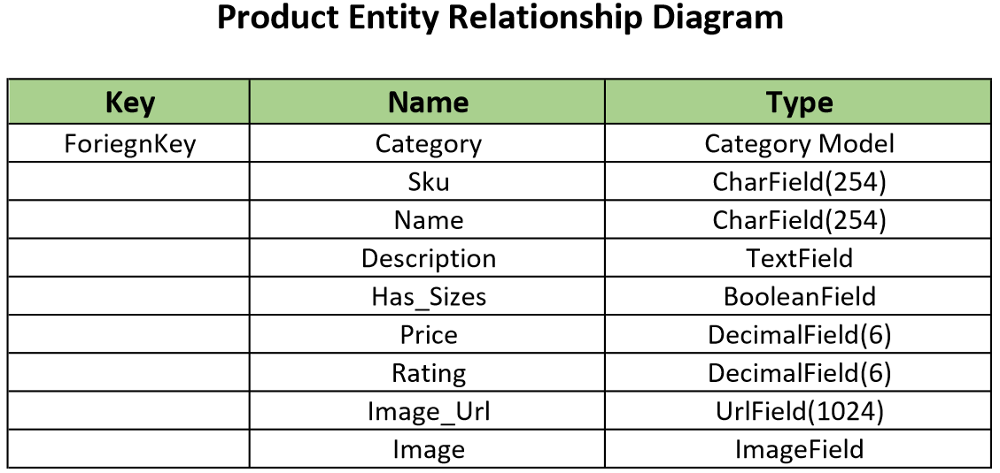
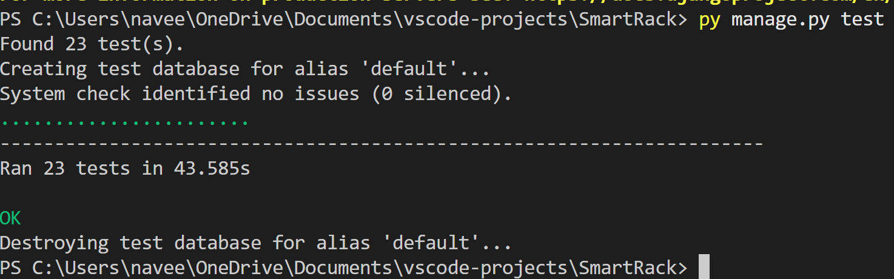
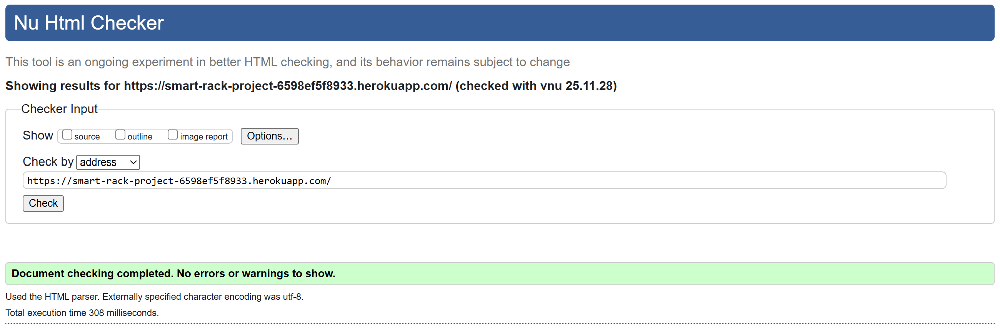
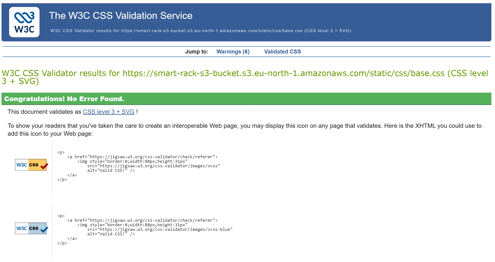
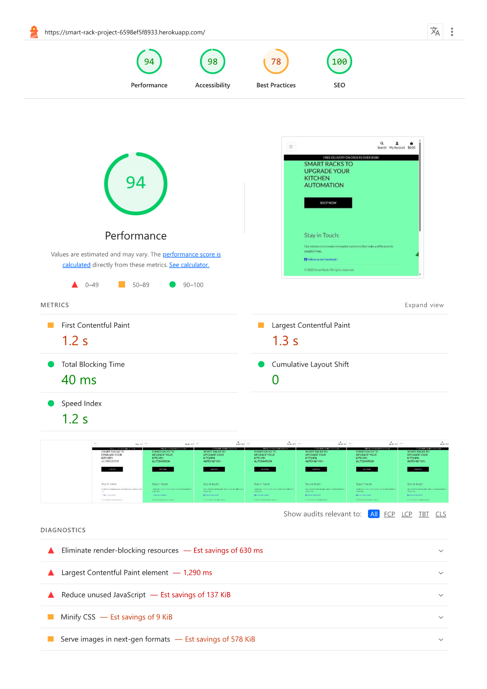
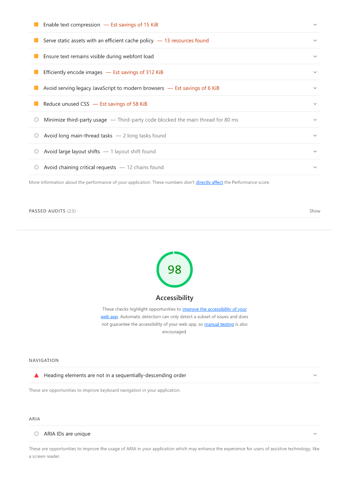
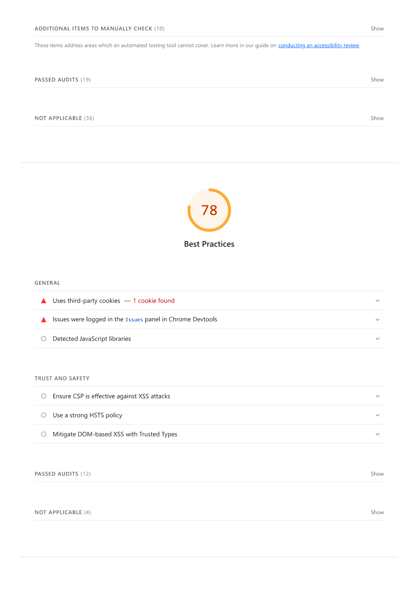
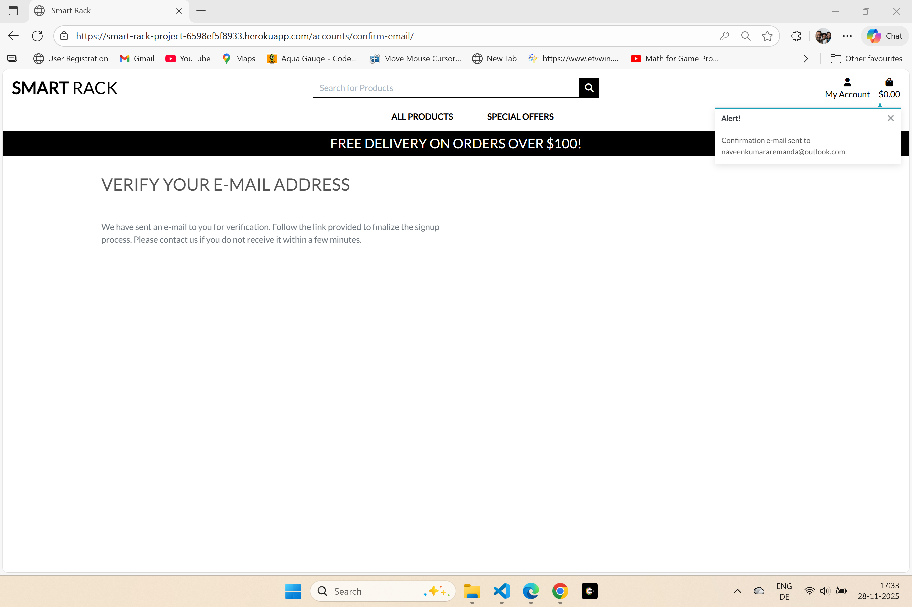

# SmartRack

---
## User Experience (UX)

### User Stories

- As

---
### Wireframes

- Home Page

---
### Relationship Diagrams

- Product Entity Relationship Diagram

---
## Features

- The Entire Site is powered by Django & styled using Bootstrap to ensure the site is responsive over different devices & different screen sizes, and at the same time providing a smooth experience for the user.

### Existing Features
- __Navigation Bar__

    The fully responsive navigation bar including links to Home, About, Register & Login

    - __Home__

        The main Home page 

### Features Left To Implement

---

## Testing

- Unit tests are writted for the python code in the project.

- Tests are written for forms & views.

- Forms test perform form validity checks and form fields validity checks.

- Views test perform render validity checks and some of submit validity checks.

- All tests return passed, command used in VS-Code Terminal - 'python manage.py test'

- The site is being manually tested over different virtual screen sizes and orientations - Potrait & Landscape.

- Manual testing was carried out on an 17 inch Laptop, Microsoft Surface Pro 7, Apple Iphone 16 Pro Max, Apple Iphone 12, Apple Ipad Air4 & Apple Ipad Pro 12.9

### Validator Testing

- HTML Validator checking passed with no errors

- CSS Validator checking passed with no errors

- Lighthouse Score tested on Chrome Browser.

    
### Testing User Stories from User Experience (UX) Section

- As a site user 

---
## Known Bugs

---
## Deployment

- This site is deployed from Heroku hosting platform

- Steps for Deployment
    - Fork or Clone this Repository
    - Create a new Heroku App
    - Set the buildpacks to python
    - Reveal Config Vars to add secret keys and its respective values
    - Link the Heroku App to the Repository
    - Click on Deploy (optionally Automatic Deployment)
   

The live link can be found here - https://smart-rack-project-6598ef5f8933.herokuapp.com/

---
## Credits
- This project is developed based on the reference project taught by [Code Institute](https://codeinstitute.net/global/) on Full Stack Development Course

---
## Content
- All content was written by the developer.

